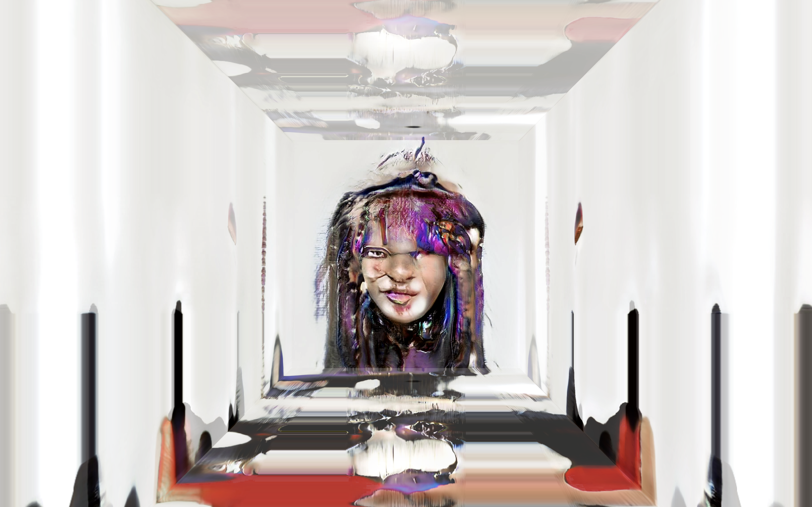

# Субкультурная генетика
###### Проект для выставки [Faces&Laces2019](https://2019.faceslaces.com)
- Фото — работы студентов курса «[Фотография в медиа](https://www.instagram.com/photo_in_media)»
- Видео — процесс обучения моделей [ProGAN](https://github.com/tkarras/progressive_growing_of_gans), спасибо [Вадиму Эпштейну](https://github.com/eps696) за работу над созданием видеороликов с высоким разрешением .
- [Патч](https://cables.gl/p/5d049ce2059171295e0e250b?s=ubFrf2W6byWJK3bW) [HDR](https://cables.gl/p/5cf9c1fd76cd9f7ebaead15a?s=36Xd2XtwJHAGMGHt) создан с помощью [cables.gl](https://cables.gl/)
 

